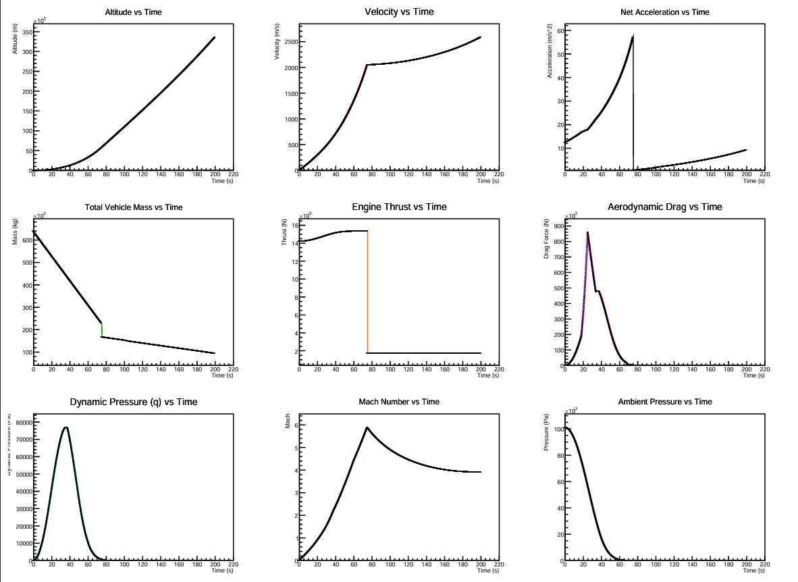
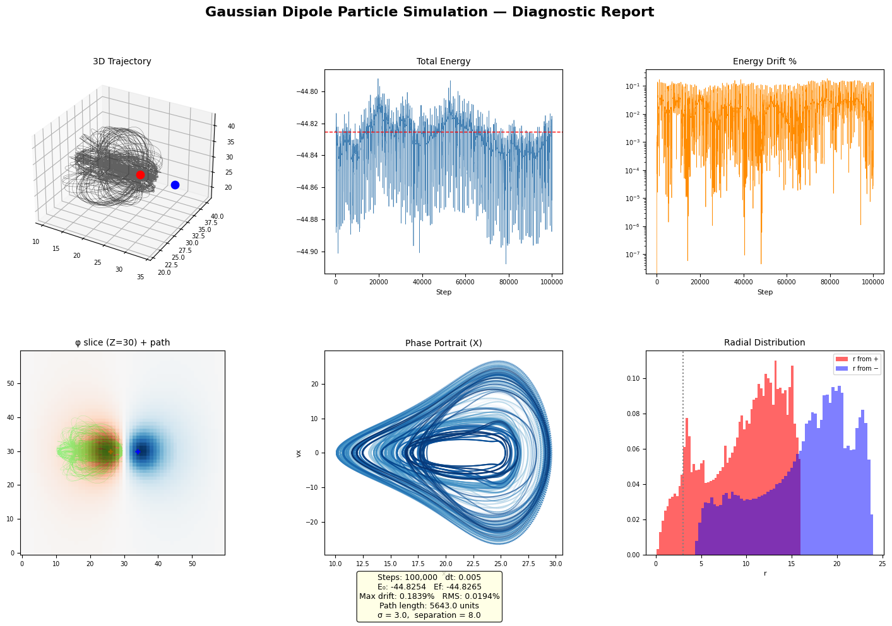

# SchrödingerLib: High-Performance Numerical Analysis & Physical Simulation

**SchrödingerLib** is a comprehensive C++23 toolkit designed for high-fidelity physical simulations, signal processing, and numerical modeling. Built upon the **CERN ROOT Data Analysis Framework**, the project leverages industrial-grade libraries to deliver precise analytical results and professional telemetry visualizations.

---

## 🛠 Core Modules

### 1. Aerospace Integration (ISRO LVM3 Simulator)
A high-fidelity trajectory integrator utilizing the **Leapfrog (Midpoint) Method** for superior energy conservation over long-duration simulations.
*   **Decoupled Architecture**: Implements a **Dependency Injection** pattern, separating planetary physics (`IEnvironment`) from vehicle engineering (`IRocket`).
*   **Atmospheric Model**: Integrates the **U.S. Standard Atmosphere (1976)** to compute geopotential altitude, dynamic pressure, and ambient density across 7 layers.
*   **Dynamic Staging**: Simulates the ISRO LVM3 flight profile with sequential fuel-based staging (S200 -> L110 -> C25) and automated Payload Fairing (PLF) jettison at 115km.
*   **Aerodynamics**: Features a Mach-dependent $C_d$ drag model, accounting for the transonic wave-drag peak and dynamic reference area changes.
*   **Telemetry**: Generates a professional 3x3 telemetry grid (PDF) visualizing 9 synchronized parameters including **Max-Q (Dynamic Pressure)** and Mach transitions.



### 2. Signal Processing (FFT Toolkit)
A robust frequency-domain filtering module for PCM audio data.
*   **Algorithm**: Utilizes the **Cooley-Tukey FFT** (implemented via ROOT's `TVirtualFFT`) to perform forward and inverse transforms.
*   **Filtering**: Implements a surgical band-stop filter to eliminate user-defined frequency ranges with amplitude normalization.

### 3. Thermodynamic Analytics (Heat Diffusion)
Solves the spatial-temporal state of the heat equation using analytical Green's functions.
*   **Visualization**: Evaluates Gaussian point source diffusion in 1D and 3D space, exporting high-frame-rate animated GIFs of the thermal evolution.

### 4. Mathematical Utilities
*   **Root Finding**: Implements a robust multi-interval **Bisection Scanner** combined with **Cauchy's Bound** analysis to isolate polynomial roots.

### 5. Electrostatic Dipole & CIC Simulation
A high-fidelity electrostatic plasma and particle tracking simulation.
*   **Grid Deposition**: Implements 2D bilinear and 3D trilinear **Cloud-in-Cell (CIC)** charge mapping algorithms.
*   **Poisson Solver**: Solves $\nabla^2 \phi = -\rho / \epsilon_0$ in Fourier space using 3D Spectral FFT transforms via `TVirtualFFT`.
*   **Integrator**: Simulates test particle trajectories in the computed 3D dipole electric fields using a symplectic **Leapfrog Integrator** with perfect elastic boundary collisions.
*   **Diagnostics**: Custom signal processing tools computing power spectral density (PSD) of particle speed via **Welch's Method** and mapping crossings of the $Y=30$ plane via a **Poincaré Section**.



---

## 🚀 Technical Standards

*   **Language**: C++23 (ISO Standard).
*   **Frameworks**: CERN ROOT (Primary), Qt6 (GUI).
*   **Memory Management**: RAII principles with `std::unique_ptr` for dependency injection and explicit ROOT object lifecycle management.
*   **Convention**: Strict `variable_name_unit` naming convention (e.g., `mass_kg`, `altitude_m`, `sample_rate_hz`) to ensure physical dimensional consistency.

---

## 📦 Build & Execution

### Prerequisites
*   **CERN ROOT**: Ensure `ROOTSYS` is configured in your environment.
*   **CMake**: Version 3.15 or higher.
*   **Dependencies**: FFTW3 and VDT (`cern-vdt` on Arch/Linux) are required to build and execute the FFT solvers.

### Compilation & Run (Linux & WSL)
```bash
cd numerical_analysis
mkdir -p build_linux && cd build_linux
cmake ..
make -j$(nproc)
./runme
```

### Compilation & Run (Windows Native MSVC)
You must initialize the ROOT variables before compiling or running. See [WINDOWS_QUIRKS.md](file:///c:/Users/karti/dev/schrodingerlib/WINDOWS_QUIRKS.md) for detailed platform tricks.
```powershell
cd numerical_analysis
cmake -B build
cmake --build build --config Release
.\build\Release\runme.exe
```

> [!NOTE]
> All telemetry sheets, diagnostic PDF dashboards, plots, and WAV/GIF files generated by the simulation programs are automatically placed in the `./outputs/` directory relative to the execution directory.

---

## 🗺 Roadmap
- [ ] **Sturm's Theorem**: Exact real root counting for the Polynomial module.
- [ ] **MarsEnvironment**: Extension of `IEnvironment` for extraterrestrial simulations.
- [ ] **Monte Carlo Analysis**: Sensitivity testing for launch window variations.

*Developed for engineers and physics researchers.*
